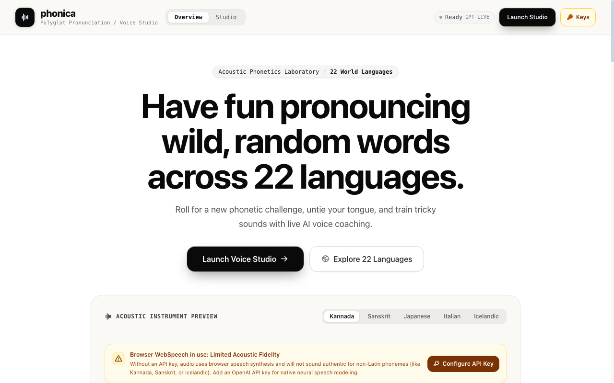
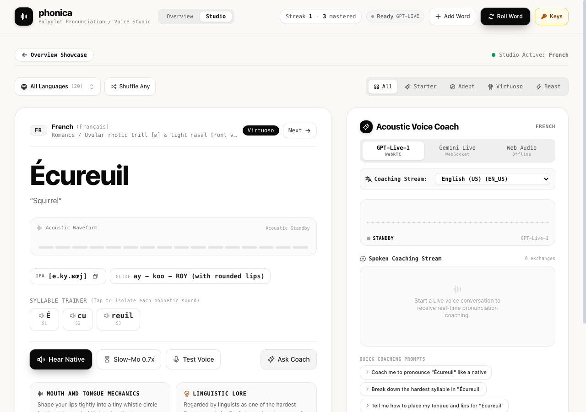

# phonica
> Practice wild, random words across 22 languages with real-time acoustic voice coaching.


https://github.com/user-attachments/assets/e0b1dfae-7b3f-4873-b8e8-024e41ef6e96


```bash
npm install
```

## Quick start

```bash
npm run dev
```

Runs the studio at `http://localhost:5180`. Connect your microphone, pick any language, and roll for a word.

## Live voice coaching

Full-duplex audio over WebRTC (OpenAI `gpt-live-1`) or WebSocket (Google `gemini-3.8-live` and `gemini-3.8-live-extended-thinking`).

```js
import { OpenAILiveClient } from './src/services/openaiLive';

const client = new OpenAILiveClient({
  apiKey: process.env.OPENAI_API_KEY,
  model: 'gpt-live-1',
  voiceName: 'alloy',
  coachingLanguage: 'English',
  onTranscript: (role, text) => console.log(`${role}: ${text}`),
  onAudioLevel: (level) => updateWaveform(level),
});

await client.connect('Guide me through pronouncing this word like a native.');
```

`connect()` opens the real-time audio stream. `sendPrompt()` injects coaching guidance mid-session without stopping audio.

## Syllable trainer

Isolate phonemes, listen at 0.7x speed, and inspect anatomical tongue placement.

```js
import { SpeechService } from './src/services/speech';

// Slow-motion pronunciation isolation
await SpeechService.speak('écureuil', { id: 'french', code: 'fr-FR' }, true);
```

`speak()` handles native pronunciation cadences and slowed phonetic sound breakdowns.

## Acoustic evaluation

Transcribes your spoken voice with Gemini Transcribe or Whisper and scores phonetic accuracy per syllable.

```js
import { SpeechService } from './src/services/speech';

const score = SpeechService.evaluatePronunciation(heardText, currentWord, currentLanguage);
// { score: 88, syllableMatch: [...], feedback: 'Clean uvular trill.' }
```

Evaluates acoustic resonance against international phonetic alphabet (IPA) targets.

## Screenshots





## Demo

Live at [h3manth.com/ai/phonica](https://h3manth.com/ai/phonica/)

## License

MIT © [Hemanth.HM](https://h3manth.com)
